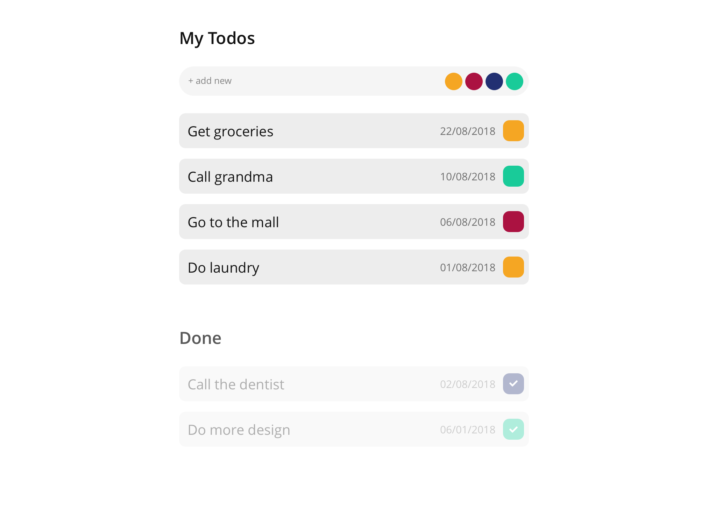

# Vue + Typescript 



Following the design in `todo.png` create a simple Todo app with Vue and Typescript.

Use the provided [VueJS](https://vuejs.org) TypeScript template.

The app is setup to use:
- [Vue](https://vuejs.org)
- [Vuex](https://vuex.vuejs.org) (for managing the app store)
- [Vue Router](https://router.vuejs.org) (for managing routes)
- [Cypress](https://cypress.io) (for e2e testing)

The skeleton in the example includes `TODO` fragments to give you some guidance. Feel free to change the current structure if you feel you'll need to.  As you build the app, feel free to add any style or component as you need them.

## Install

- Clone this repo
- `cd app`
- Run `yarn install` or `npm install`

## Run

#### Compile and hot-reloads for development
```
yarn serve
```
or
```
npm run serve
```